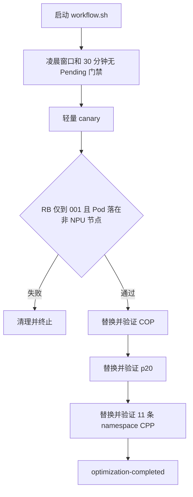

# Karmada 调度优化自动化

该模块在北京时间凌晨自动完成轻量灰度验证，并按固定顺序安全替换 Karmada 调度策略。脚本为非交互式执行，不包含密码提示、二次确认、长期监控或自动问题归因。

## 变更范围

只修改：

| 阶段 | 对象 | 变更 |
| --- | --- | --- |
| COP | `non-npu-vcjob-node-affinity` | 保留非 NPU required 约束，增加 `node.cce.io/billing-mode=pre-paid`、权重 100 的软偏好 |
| p20 | `non-npu-vcjob-prefer-001` | 将 `clusterAffinity` 替换为 `has-cpu=true` |
| Namespace | 11 条 namespace CPP | 将 `clusterAffinity` 替换为 `dispatch/auto=true` |

不修改 p10、HNA、Cluster 标签、Queue、业务配置或其他策略对象。正式环境成员集群固定为 `001` 和 `wlcb`。

## 自动流程



默认门禁：

- 北京时间 `00:00-06:00`
- 001 和 wlcb 连续 1800 秒无任何 Pending
- Karmada 成员集群全部 Ready
- 两个成员集群的 `shared-flexible-queue` 均为 Open
- 每个策略阶段通过后再执行 300 秒稳定性门禁

## 灰度标准

canary 是一个临时 Volcano Job，默认使用 `busybox:1.36`、`10m CPU / 16Mi`，执行 `sleep 30`。

只验证调度结果：

1. ResourceBinding 精确指向 001。
2. Pod 在 001 进入 Running 或 Succeeded。
3. Pod 已绑定节点。
4. 节点不带 `accelerator/huawei-npu` 标签。

脚本不等待业务结果，也不执行存储、网络或性能验证。

## 安全替换

- 修改前保存完整 live YAML用于审计。
- 单独保存实际修改字段，用于精准恢复。
- COP 保留其他 affinity 内容，不整体替换 `overrideRules`。
- p20 修改前确认 `has-cpu=true` 只解析到 001。
- namespace 修改前后确认 `dispatch/auto=true` 只解析到 `001 wlcb`。
- 任一阶段修改后失败，自动恢复当前失败阶段修改的字段并终止。
- workflow 使用本地目录锁防止并发执行。

## 环境变量

必须显式提供三个 kubeconfig 路径，仓库不包含任何 kubeconfig 或凭据：

```bash
export KARMADA_KUBECONFIG="/path/to/karmada.yaml"
export CLUSTER_001_KUBECONFIG="/path/to/001.yaml"
export CLUSTER_WLCB_KUBECONFIG="/path/to/wlcb.yaml"
```

可选配置：

| 变量 | 默认值 |
| --- | --- |
| `KUBECTL_BIN` | `kubectl` |
| `TEST_QUEUE` | `shared-flexible-queue` |
| `TEST_IMAGE` | `busybox:1.36` |
| `NIGHT_START_HOUR` | `0` |
| `NIGHT_END_HOUR` | `6` |
| `STABLE_SECONDS` | `1800` |
| `POLL_SECONDS` | `60` |
| `STAGE_STABLE_SECONDS` | `300` |
| `RUNTIME_DIR` | `./runtime` |

## 执行

启动 workflow 即授权其在上述固定范围内执行生产调度写操作，无需二次确认：

```bash
cd karmada-scheduling-optimization
bash ./workflow.sh
```

脚本内部没有 `read`、`sudo`、交互式 kubectl、浏览器登录或云 CLI 登录。若 kubeconfig 使用静态客户端证书，启动后无需再次输入凭据。

OpenCode 是否在启动 Bash 前要求工具授权，由 OpenCode 外层权限配置决定。OpenCode 启动 `workflow.sh` 后，后续 kubectl 是该进程内部子命令，脚本不会逐条请求确认。执行工具的超时必须覆盖 30 分钟启动门禁及三个阶段各 5 分钟的稳定性验证。

## 状态与文件

运行数据写入 `runtime/`，该目录已被 Git 忽略，包含 RUN_ID、日志、健康报告、审计备份、字段备份和阶段标记。

查看状态：

```bash
bash ./status.sh RUN_ID
```

成功完成时应看到：

```text
stage=optimization-completed
canary-passed=true
cop-passed=true
p20-passed=true
namespaces-passed=true
```

## 人工回滚

workflow 不执行长期监控或事后自动回滚。人工确认需要撤销某次运行时：

```bash
bash ./40-rollback.sh --execute RUN_ID
```

回滚顺序为 `11 条 namespace CPP -> p20 -> COP`，只恢复该 RUN_ID 备份的调度字段。

## 失败行为

| 场景 | 行为 |
| --- | --- |
| 不在凌晨窗口 | 持续等待 |
| 健康门禁失败 | 重置稳定计时并继续等待 |
| canary 失败 | 清理 canary，终止，不修改正式策略 |
| 策略阶段失败 | 恢复当前阶段字段，终止后续阶段 |
| 凭据、RBAC 或 API 错误 | 输出错误并终止或继续当前等待循环，不询问用户 |
| 已有 workflow 运行 | 立即失败，避免并发操作 |

## 本地验证

以下命令不访问集群：

```bash
bash -n ./*.sh ./lib/*.sh
python3 ./tests/test-health.py
```
